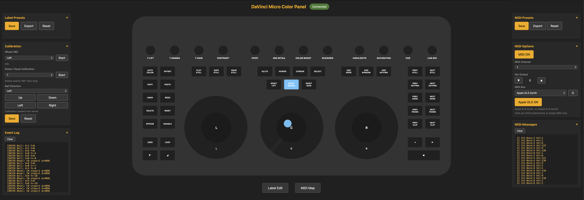

# BMD Micro Color Panel MIDI Controller



Turn your Blackmagic DaVinci Resolve Micro Color Panel into a fully customisable MIDI controller. Web-based GUI with real-time visual feedback, MIDI mapping, calibration, and preset management.

> **Inspiration**: This project is a derivative of [micro-color-panel-controller](https://github.com/ra100/micro-color-panel-controller) by [ra100](https://github.com/ra100). That project provided the foundation for reverse-engineering the panel's HID protocol.

## Features

- **USB HID Control** — Connects directly to BMD Micro Color Panel (USB PID 0xda0f)
- **Web GUI** — Visual panel representation at http://localhost:8766 with real-time feedback
- **Relative CC MIDI Output** — All continuous controls (rotaries, jog wheels, trackballs) output relative CC messages proportional to physical movement
- **MIDI Mapping** — Click any control in MIDI Map mode to assign custom CC/note numbers
- **Label Presets** — Save and switch between custom button/rotary/wheel/ball label layouts
- **Preset System** — Save/load/export complete MIDI mappings
- **Calibration** — Fine-tune rotary, wheel, and trackball sensitivity per control

## Platform Support

This project was developed and tested on **macOS**. It should work on Windows and Linux with the adjustments listed below, but these have not been verified.

## Requirements

- macOS (primary), Windows or Linux (untested)
- Node.js 18+
- **sudo** (macOS/Linux) or **Administrator** (Windows) for USB HID access

## Installation

Open Terminal and run these steps in order:

**① Install Homebrew** (if not already installed)
```bash
/bin/bash -c "$(curl -fsSL https://raw.githubusercontent.com/Homebrew/install/HEAD/install.sh)"
```

**② Install Node.js** (if not already installed)
```bash
brew install node
```

**③ Install dependencies** (first time only, run from the project folder)
```bash
cd BMD-Micro-Color-Panel-MIDI
npm install
```

**④ Start the server**
```bash
sudo node server.mjs
```

> The server requires `sudo` for USB HID access. It will automatically open the GUI in your browser at http://localhost:8766.

If the browser doesn't open automatically, navigate to http://localhost:8766 manually. If the panel isn't connected, the GUI will display the exact commands needed to start the server.

## Auto-start on Boot (macOS)

To have the server start automatically at login, install it as a LaunchDaemon:

```bash
sudo cp com.bmd.microcolorpanel.plist /Library/LaunchDaemons/
sudo launchctl load /Library/LaunchDaemons/com.bmd.microcolorpanel.plist
```

To stop/start manually:
```bash
sudo launchctl stop com.bmd.microcolorpanel
sudo launchctl start com.bmd.microcolorpanel
```

To uninstall:
```bash
sudo launchctl unload /Library/LaunchDaemons/com.bmd.microcolorpanel.plist
sudo rm /Library/LaunchDaemons/com.bmd.microcolorpanel.plist
```

## MIDI Output

All continuous controls send **relative CC messages** — the CC value encodes direction and magnitude proportional to the physical movement:

| Value range | Meaning |
|-------------|---------|
| 1–63 | Clockwise / positive (larger = faster) |
| 65–127 | Counter-clockwise / negative (larger = faster) |
| 64 | Unused (centre) |

### Default MIDI Assignments

| Control | MIDI |
|---------|------|
| Left Trackball X | CC 1 |
| Left Trackball Y | CC 2 |
| Centre Trackball X | CC 3 |
| Centre Trackball Y | CC 4 |
| Right Trackball X | CC 5 |
| Right Trackball Y | CC 6 |
| Left Jog Wheel | CC 7 |
| Centre Jog Wheel | CC 8 |
| Right Jog Wheel | CC 9 |
| Rotary Knobs 1–12 | CC 60–71 |
| Buttons 1–40 | Notes 1–40 |

CC numbers for rotaries and buttons can be reassigned per-control in the GUI's MIDI Map mode.

### MIDI Setup (macOS)

1. Open **Audio MIDI Setup** (in `/Applications/Utilities/`)
2. Go to **Window → Show MIDI Studio**
3. Double-click **IAC Driver** and enable it
4. In the GUI, select **IAC Driver Bus 1** as the MIDI output device

## Calibration

The GUI includes calibration tools for each control type:

- **Jog Wheel 360** — Turn the wheel one full revolution to calibrate degrees per step
- **Rotary Knobs** — Turn any knob 180° to calibrate degrees per raw unit
- **Trackballs** — Roll the ball to set axis signs and sensitivity gain

Calibration data is saved to `calibration.json` and reloaded on server start.

## Troubleshooting

### Panel not detected
- Ensure the USB cable is connected before starting the server
- Run with `sudo` — USB HID access requires root on macOS

### MIDI not working
- Check that IAC Driver is enabled in Audio MIDI Setup
- Make sure the correct MIDI output device is selected in the GUI (MIDI Options panel)
- Check the **MIDI Messages** panel in the GUI for real-time output confirmation

### Server won't start
- Check for another running instance: `sudo lsof -i :8765`
- Verify nothing else is using ports 8765 or 8766

## Tech Stack

- **Node.js** — Server runtime
- **usb** — USB HID communication
- **ws** — WebSocket server
- **JZZ** — MIDI I/O

## Known Issues

### Rotary Knobs — spurious direction reversal on fast spins
When a knob is spun very quickly, the direction hysteresis filter can misread the peak velocity samples as a reversal, sending a brief burst of CC messages in the wrong direction before correcting. Slow to medium turns are reliable. A 2-frame confirmation buffer is in place; increasing it reduces false reversals at the cost of slightly delayed direction changes.

### Apple DLS Synth activates when MIDI is enabled
Enabling MIDI output via the toggle in the GUI will automatically switch to the Apple DLS Software Synthesiser if it is the first available MIDI device. To route MIDI to a DAW or MIDI2LR, ensure **IAC Driver Bus 1** is selected as the output device in the MIDI Options panel before enabling MIDI. The Apple DLS toggle in the GUI can also be used to explicitly switch between the synth and your chosen output device.

### General
- **No MIDI input** — The panel only sends HID data; it cannot receive MIDI back
- **One-way communication** — Panel button LEDs cannot be controlled from software
- **Platform** — Requires `sudo` for USB HID; tested on macOS

## Running on Windows

> This project was built and tested on macOS. Windows support is theoretical — the steps below should work but have not been verified.

**Additional one-time setup required:**

1. **Install Node.js** — download the installer from [nodejs.org](https://nodejs.org) (no Homebrew needed)
2. **Replace the USB driver** — the `usb` package requires libusb, which Windows doesn't use by default for HID devices:
   - Download and run [Zadig](https://zadig.akeo.ie/)
   - Select the BMD Micro Color Panel device
   - Replace its driver with **WinUSB**
   - ⚠️ This may prevent DaVinci Resolve from recognising the panel while the WinUSB driver is active
3. **Virtual MIDI port** — macOS has a built-in IAC Driver; on Windows install [loopMIDI](https://www.tobias-erichsen.de/software/loopmidi.html) to create a virtual MIDI port
4. **Run as Administrator** — open Terminal (or PowerShell) as Administrator instead of using `sudo`:
   ```
   node server.mjs
   ```
5. **Auto-start** — use Task Scheduler instead of LaunchDaemon to run the server at login

Everything else (the web GUI, WebSocket, MIDI output) is platform-agnostic and should work without changes.

## Contributing

1. Fork the repo
2. Create a feature branch
3. Make your changes
4. Submit a pull request

## License

MIT — see [LICENSE](LICENSE) file
