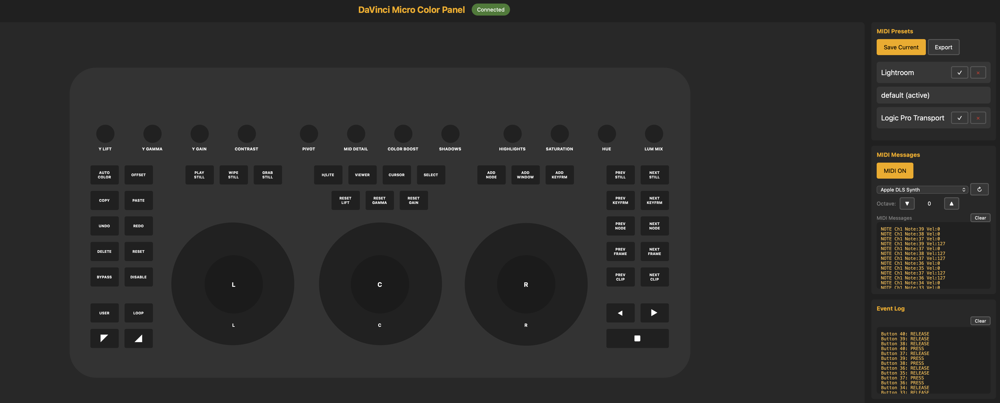

# BMD Micro Color Panel MIDI Controller



A web-based GUI editor with MIDI output for the BlackMagic DaVinci Resolve Micro Color Panel.

## Features

- **USB HID Control** - Connects directly to BMD Micro Color Panel (USB PID 0xda0f)
- **Web GUI** - Visual panel representation at http://localhost:8766
- **MIDI Output** - Send notes/CC to DAWs like Logic Pro or Lightroom via MIDI2LR
- **Preset System** - Save/load/export custom MIDI mappings
- **Real-time Updates** - Adjust sensitivity (step/throttle) via UI sliders

## Requirements

- macOS (Linux/Windows support can be added)
- Node.js 18+
- **sudo** for USB HID access

## Installation

```bash
cd BMD-Micro-Color-Panel-MIDI
npm install
```

## Usage

1. Connect the BMD Micro Color Panel via USB
2. Run the server with sudo:

```bash
sudo npm start
```

3. Open http://localhost:8766 in your browser

## MIDI Configuration

### Default MIDI Assignments

| Control | MIDI |
|---------|------|
| Rotary 0-11 | Notes 60-71 (C4-B4) |
| Left Wheel | CC0 |
| Center Wheel | CC0 |
| Right Wheel | CC0 |
| Trackballs | CC1 (X), CC2 (Y) |
| Buttons 12-51 | Notes 1-40 |

### For Lightroom

Import `MicroPanel_LR.xml` into MIDI2LR:

| Control | Lightroom Action |
|---------|------------------|
| RWD | Previous Photo |
| FWD | Next Photo |
| Rotary 3 (Contrast) | Contrast |
| Rotary 5 (Mid Detail) | Clarity |
| Rotary 6 (Color Boost) | Vibrance |
| Rotary 7 (Shadows) | Shadows |
| Rotary 8 (Highlights) | Highlights |
| Rotary 9 (Saturation) | Saturation |

## Presets

- **Default** - Basic MIDI mapping
- **Lightroom** - Optimized for Lightroom/MIDI2LR
- **Logic Pro Transport** - Transport controls for Logic Pro

### Creating Custom Presets

1. Configure your desired button mappings in the UI
2. Click "Save Current" to save your preset
3. Presets are stored in the `presets/` folder

## Settings

Adjust sensitivity in the Settings panel:

- **Rotary Step** - How fast values change (1-10)
- **Rotary Throttle** - Delay between updates (0-50ms)
- **Ball Step/Throttle** - Trackball sensitivity
- **Wheel Step/Throttle** - Jog wheel sensitivity

## Troubleshooting

### Panel not detected
- Ensure USB cable is connected
- Run with `sudo` (required for USB HID)

### MIDI not working
- Enable IAC Driver in Audio MIDI Setup (Mac)
- Use MIDI2LR to map MIDI to Lightroom commands
- Import `presets/MicroPanel_LR.xml` into MIDI2LR

### Server won't start
- Check if another instance is running
- Verify no other process is using port 8765/8766

## Tech Stack

- **Node.js** - Server runtime
- **usb** - USB HID communication
- **ws** - WebSocket server
- **JZZ** - MIDI I/O

## Contributing

1. Fork the repo
2. Create a feature branch
3. Make your changes
4. Submit a pull request

## License

MIT - see [LICENSE](LICENSE) file